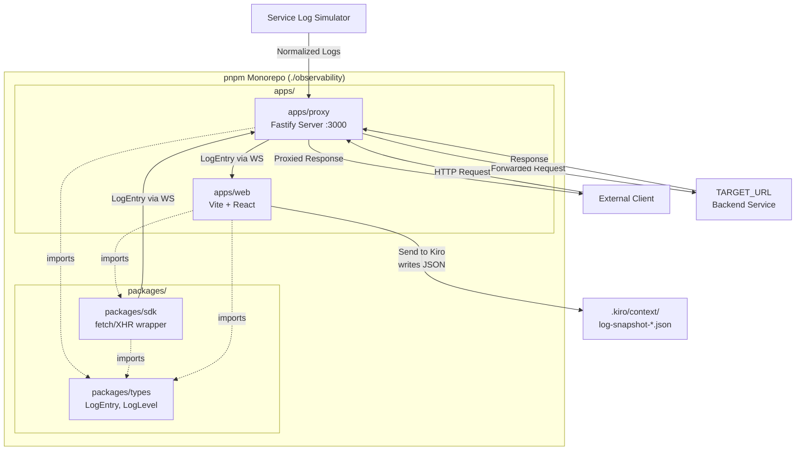
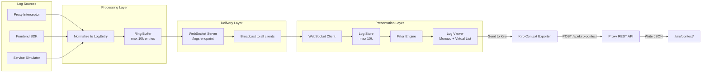
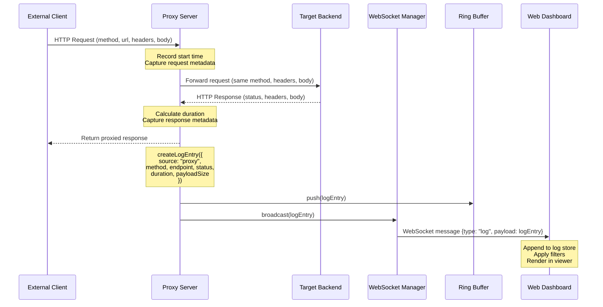
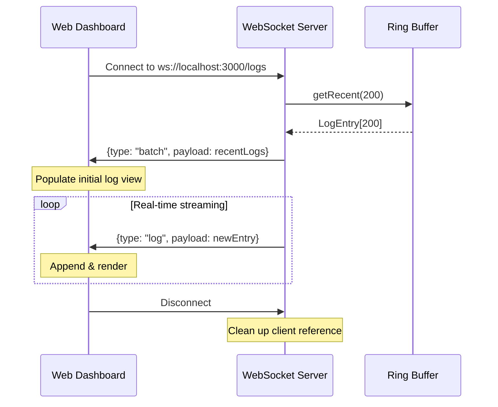
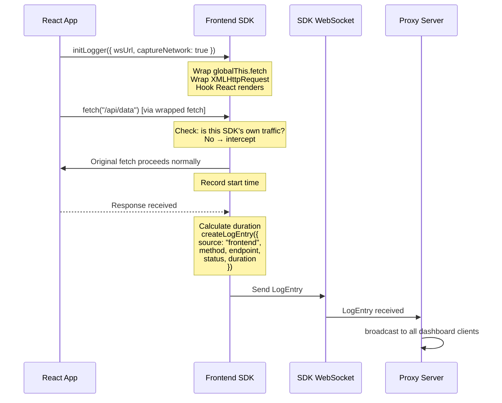
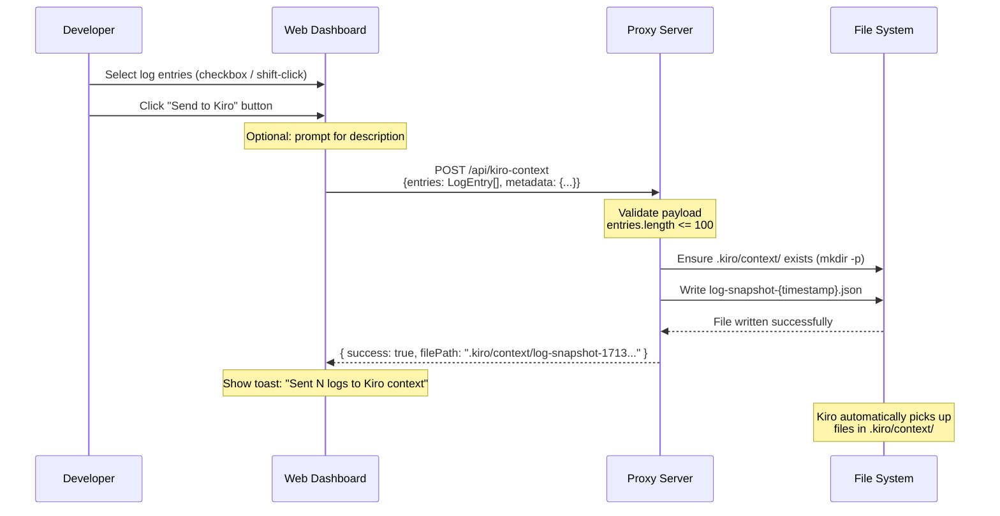

# Design Document: Observability Proxy System

## Overview

The Observability Proxy System is a real-time development observability tool that intercepts, captures, and visualizes HTTP traffic and application logs across a full-stack TypeScript application. It consists of three core subsystems: a Fastify-based reverse proxy that intercepts all HTTP requests/responses and captures metadata, a WebSocket-based streaming layer that broadcasts structured log entries to connected clients, and a React-based dashboard that renders logs in real-time with filtering, grouping, and export capabilities.

The system is organized as a pnpm monorepo with four packages: the proxy server (`apps/proxy`), the web dashboard (`apps/web`), shared type definitions (`packages/types`), and a frontend SDK (`packages/sdk`) that instruments `fetch`/`XHR` calls and React renders. All packages share a common `LogEntry` schema, ensuring type-safe communication across the entire pipeline. The architecture supports three log sources — proxy-intercepted traffic, frontend SDK instrumentation, and external service logs — all normalized into a unified format and streamed to the dashboard in real-time.

The system is designed for local development use, prioritizing developer experience, low latency, and zero-configuration setup. It follows a strict 13-step build pipeline with validation gates at each step to prevent regressions.

A key developer experience feature is the ability to send one or more selected log entries directly to Kiro's AI context. From the dashboard, developers can select individual logs or multi-select a batch, then click "Send to Kiro" to write the selected entries as a formatted JSON file into the `.kiro/context/` directory. Kiro automatically picks up files in this directory, allowing developers to seamlessly share runtime log data with the AI for debugging assistance, root cause analysis, or code generation informed by real traffic patterns.

## Architecture

### System Overview



### Data Flow Architecture



## Components and Interfaces

### Component 1: Proxy Server (`apps/proxy`)

**Purpose**: Reverse proxy that intercepts all HTTP traffic, captures request/response metadata, and broadcasts structured log entries via WebSocket.

**Interface**:
```typescript
interface ProxyServer {
  start(port: number): Promise<void>;
  stop(): Promise<void>;
  getBuffer(): LogEntry[];
}

interface ProxyConfig {
  port: number;
  targetUrl: string;
  wsPath: string;
  bufferSize: number;
}
```

**Responsibilities**:
- Intercept all incoming HTTP requests and forward to `TARGET_URL`
- Capture request metadata: method, url, query, headers (sanitized), body, payload size
- Capture response metadata: status, body, size, duration
- Create `LogEntry` for each request/response cycle
- Broadcast log entries to all connected WebSocket clients
- Maintain a ring buffer of the last 10,000 log entries
- Send the last 200 entries to newly connected WebSocket clients

### Component 2: WebSocket Streaming Layer

**Purpose**: Real-time bidirectional communication channel for log delivery.

**Interface**:
```typescript
interface WebSocketManager {
  initialize(server: FastifyInstance): void;
  broadcast(entry: LogEntry): void;
  getConnectedClients(): number;
  getBuffer(): LogEntry[];
}

interface WebSocketMessage {
  type: "log" | "batch" | "clear";
  payload: LogEntry | LogEntry[];
}
```

**Responsibilities**:
- Manage WebSocket connections at `/logs` endpoint
- Broadcast individual log entries to all connected clients
- Send batch of last 200 logs on new client connection
- Handle client disconnections gracefully
- Accept incoming logs from SDK clients

### Component 3: Web Dashboard (`apps/web`)

**Purpose**: Real-time log visualization dashboard with filtering, grouping, and export.

**Interface**:
```typescript
interface DashboardState {
  logs: LogEntry[];
  filters: FilterState;
  isPaused: boolean;
  autoScroll: boolean;
  selectedLog: LogEntry | null;
  selectedLogIds: Set<string>;   // Multi-selection for "Send to Kiro"
}

interface FilterState {
  type: LogLevel | null;
  source: LogSource | null;
  endpoint: string;
  text: string;
}
```

**Responsibilities**:
- Connect to proxy WebSocket and receive log entries
- Store up to 10,000 logs in memory
- Render logs in a virtualized list for performance
- Display selected log detail in Monaco Editor with JSON formatting
- Apply real-time filters (type, source, endpoint, text search)
- Support pause/resume/clear controls
- Export logs as JSON
- Group and collapse related logs
- Highlight errors, show duration badges, truncate large payloads
- Support multi-selection of log entries (checkbox per row, shift-click for range)
- Provide "Send to Kiro" button in the toolbar that sends selected entries to `.kiro/context/`
- Show toast notification confirming how many entries were sent and the file path

### Component 4: Shared Types (`packages/types`)

**Purpose**: Single source of truth for all shared type definitions and factory functions.

**Interface**:
```typescript
// Core types
type LogLevel = "log" | "info" | "debug" | "warn" | "error";
type LogSource = "proxy" | "frontend" | "service";

interface LogEntry {
  id: string;
  timestamp: number;
  type: LogLevel;
  source: LogSource;
  group: string;
  message: string;
  method?: string;
  endpoint?: string;
  query?: Record<string, unknown>;
  body?: unknown;
  response?: unknown;
  status?: number;
  duration?: number;
  payloadSize?: number;
  error?: string;
}

// Factory function
function createLogEntry(partial: Partial<LogEntry> & Pick<LogEntry, "type" | "source" | "message">): LogEntry;
```

**Responsibilities**:
- Define `LogEntry` interface used across all packages
- Define `LogLevel` and `LogSource` union types
- Provide `createLogEntry()` factory with sensible defaults (auto-generated `id`, `timestamp`)
- Ensure type safety across package boundaries

### Component 5: Frontend SDK (`packages/sdk`)

**Purpose**: Instruments browser APIs to capture frontend network activity and React render events.

**Interface**:
```typescript
interface SDKConfig {
  wsUrl: string;
  captureNetwork: boolean;
  captureRenders: boolean;
  maxPayloadSize: number;
}

interface ObservabilitySDK {
  init(config?: Partial<SDKConfig>): void;
  destroy(): void;
  log(level: LogLevel, message: string, data?: unknown): void;
}

function initLogger(config?: Partial<SDKConfig>): ObservabilitySDK;
```

**Responsibilities**:
- Wrap `globalThis.fetch` to intercept network requests
- Wrap `XMLHttpRequest` to intercept XHR calls
- Capture request/response data, errors, and duration
- Hook into React render lifecycle (mount/update events)
- Send log entries to proxy via WebSocket (HTTP fallback)
- Prevent infinite loops (SDK must not log its own traffic)
- Expose `initLogger()` as the single entry point


### Component 6: Kiro Context Exporter

**Purpose**: Enables developers to send selected log entries from the dashboard directly into Kiro's AI context by writing structured JSON snapshots to the `.kiro/context/` directory.

**Interface**:
```typescript
interface KiroContextPayload {
  entries: LogEntry[];
  metadata: {
    exportedAt: number;       // epoch ms
    count: number;            // number of entries
    source: "observability";  // identifies origin
    filters?: FilterState;    // active filters at time of export (optional)
    description?: string;     // optional user-provided description
  };
}

interface KiroContextConfig {
  contextDir: string;         // defaults to ".kiro/context"
  filePrefix: string;         // defaults to "log-snapshot"
  maxEntries: number;         // max entries per export, defaults to 100
}

// Proxy-side REST endpoint
// POST /api/kiro-context
// Body: KiroContextPayload
// Response: { success: boolean; filePath: string }

// Dashboard-side hook
function useSendToKiro(): {
  sendToKiro: (entries: LogEntry[], description?: string) => Promise<string>;
  isSending: boolean;
  lastSentPath: string | null;
  error: string | null;
};
```

**Responsibilities**:
- Accept one or more selected `LogEntry` objects from the dashboard UI
- Validate entry count does not exceed `maxEntries` (default 100) to keep context manageable
- Serialize entries as a `KiroContextPayload` JSON structure with metadata
- POST the payload to the proxy server's `/api/kiro-context` REST endpoint
- Proxy writes the JSON file to `.kiro/context/log-snapshot-{timestamp}.json`
- Ensure the `.kiro/context/` directory exists (create if missing)
- Return the written file path to the dashboard for confirmation
- Support an optional user-provided description to annotate the export
- Dashboard shows a toast notification on success/failure


## Data Models

### Model 1: LogEntry

```typescript
interface LogEntry {
  id: string;            // UUID v4
  timestamp: number;     // Date.now() epoch ms
  type: LogLevel;        // "log" | "info" | "debug" | "warn" | "error"
  source: LogSource;     // "proxy" | "frontend" | "service"
  group: string;         // Grouping key (e.g., request ID, component name)
  message: string;       // Human-readable log message

  // HTTP-specific fields (optional)
  method?: string;       // HTTP method: GET, POST, PUT, DELETE, etc.
  endpoint?: string;     // Request URL path
  query?: Record<string, unknown>;  // Parsed query parameters
  body?: unknown;        // Request body (truncated if >50kb)
  response?: unknown;    // Response body (truncated if >50kb)

  // Metrics (optional)
  status?: number;       // HTTP status code
  duration?: number;     // Request duration in milliseconds
  payloadSize?: number;  // Body size in bytes

  // Error tracking (optional)
  error?: string;        // Error message or stack trace
}
```

**Validation Rules**:
- `id` must be a valid UUID v4 string
- `timestamp` must be a positive integer (epoch milliseconds)
- `type` must be one of the `LogLevel` union values
- `source` must be one of the `LogSource` union values
- `group` defaults to `"default"` if not provided
- `message` must be a non-empty string
- `payloadSize` must be non-negative when present
- `duration` must be non-negative when present
- `status` must be a valid HTTP status code (100-599) when present
- `body` and `response` are truncated to 50kb string representation for storage

### Model 2: WebSocketMessage

```typescript
type WebSocketMessage =
  | { type: "log"; payload: LogEntry }
  | { type: "batch"; payload: LogEntry[] }
  | { type: "clear"; payload: null };
```

**Validation Rules**:
- `type` determines the shape of `payload`
- `batch` payload array length must not exceed 200 entries (initial connection batch)
- Messages are serialized as JSON strings over the WebSocket

### Model 3: RingBuffer

```typescript
interface RingBuffer<T> {
  capacity: number;      // Maximum number of entries (10,000)
  size: number;          // Current number of entries
  push(item: T): void;   // Add item, evict oldest if at capacity
  getRecent(count: number): T[];  // Get last N items
  clear(): void;         // Remove all items
  toArray(): T[];        // Get all items in insertion order
}
```

**Validation Rules**:
- `capacity` must be a positive integer, defaults to 10,000
- `getRecent(count)` returns `min(count, size)` items
- Eviction is FIFO — oldest entries are removed first when at capacity

### Model 4: KiroContextPayload

```typescript
interface KiroContextPayload {
  entries: LogEntry[];          // The log entries to send to Kiro
  metadata: {
    exportedAt: number;         // Date.now() epoch ms
    count: number;              // entries.length
    source: "observability";    // Constant — identifies this system as the origin
    filters?: FilterState;      // Active filters when export was triggered (optional)
    description?: string;       // User-provided annotation (optional, max 500 chars)
  };
}
```

**Validation Rules**:
- `entries` must be a non-empty array of valid `LogEntry` objects
- `entries.length` must not exceed 100 (configurable via `KiroContextConfig.maxEntries`)
- `metadata.count` must equal `entries.length`
- `metadata.exportedAt` must be a positive integer (epoch milliseconds)
- `metadata.source` must be `"observability"`
- `metadata.description`, if provided, must not exceed 500 characters
- The output file is named `log-snapshot-{timestamp}.json` where `{timestamp}` is `Date.now()`

## Sequence Diagrams

### Main Flow: HTTP Request Interception



### WebSocket Connection Lifecycle



### Frontend SDK Instrumentation Flow



### Send to Kiro Context Flow



## Algorithmic Pseudocode

### Algorithm 1: Proxy Request Interception

```typescript
async function handleProxyRequest(
  request: FastifyRequest,
  reply: FastifyReply
): Promise<void> {
  // PRECONDITION: request is a valid HTTP request
  // PRECONDITION: TARGET_URL is configured and reachable
  // POSTCONDITION: Client receives the exact response from TARGET_URL
  // POSTCONDITION: A LogEntry is created and broadcast

  const startTime = Date.now();

  // Step 1: Capture request metadata
  const requestMeta = {
    method: request.method,
    endpoint: request.url,
    query: request.query as Record<string, unknown>,
    headers: sanitizeHeaders(request.headers),
    body: request.body,
    payloadSize: calculatePayloadSize(request.body),
  };

  // Step 2: Forward request to target
  let targetResponse: Response;
  try {
    targetResponse = await forwardRequest(TARGET_URL, requestMeta);
  } catch (err) {
    // Target unreachable — log error, return 502
    const errorEntry = createLogEntry({
      type: "error",
      source: "proxy",
      message: `Proxy error: ${(err as Error).message}`,
      method: requestMeta.method,
      endpoint: requestMeta.endpoint,
      error: (err as Error).stack,
      duration: Date.now() - startTime,
    });
    wsManager.broadcast(errorEntry);
    return reply.status(502).send({ error: "Bad Gateway" });
  }

  const duration = Date.now() - startTime;

  // Step 3: Capture response metadata
  const responseBody = await targetResponse.text();
  const status = targetResponse.status;

  // Step 4: Create and broadcast log entry
  const logEntry = createLogEntry({
    type: status >= 400 ? "error" : "info",
    source: "proxy",
    message: `${requestMeta.method} ${requestMeta.endpoint} → ${status} (${duration}ms)`,
    method: requestMeta.method,
    endpoint: requestMeta.endpoint,
    query: requestMeta.query,
    body: truncatePayload(requestMeta.body),
    response: truncatePayload(responseBody),
    status,
    duration,
    payloadSize: requestMeta.payloadSize,
  });

  buffer.push(logEntry);
  wsManager.broadcast(logEntry);

  // Step 5: Return proxied response to client
  reply.status(status).headers(targetResponse.headers).send(responseBody);
}
```

**Preconditions:**
- `request` is a valid Fastify request object
- `TARGET_URL` environment variable is set and points to a reachable backend
- WebSocket manager and ring buffer are initialized

**Postconditions:**
- Client receives the same status code, headers, and body as the target response
- A `LogEntry` with `source: "proxy"` is created and broadcast
- The ring buffer contains the new entry (oldest evicted if at capacity)
- On target failure: client receives 502, error log is broadcast

### Algorithm 2: Ring Buffer Implementation

```typescript
class RingBuffer<T> {
  private items: T[];
  private head: number = 0;
  private count: number = 0;

  constructor(private readonly capacity: number = 10_000) {
    // PRECONDITION: capacity > 0
    this.items = new Array<T>(capacity);
  }

  push(item: T): void {
    // PRECONDITION: item is defined
    // POSTCONDITION: item is stored; if was at capacity, oldest item is evicted
    // LOOP INVARIANT: count <= capacity at all times

    const index = (this.head + this.count) % this.capacity;

    if (this.count < this.capacity) {
      this.items[index] = item;
      this.count++;
    } else {
      // Buffer full — overwrite oldest
      this.items[this.head] = item;
      this.head = (this.head + 1) % this.capacity;
      // count remains at capacity
    }
  }

  getRecent(n: number): T[] {
    // PRECONDITION: n >= 0
    // POSTCONDITION: returns min(n, count) items in insertion order (oldest first)

    const resultCount = Math.min(n, this.count);
    const startIndex = (this.head + this.count - resultCount) % this.capacity;
    const result: T[] = [];

    for (let i = 0; i < resultCount; i++) {
      // LOOP INVARIANT: result.length === i
      result.push(this.items[(startIndex + i) % this.capacity]);
    }

    return result;
  }

  clear(): void {
    // POSTCONDITION: count === 0, head === 0
    this.head = 0;
    this.count = 0;
  }

  get size(): number {
    return this.count;
  }
}
```

**Preconditions:**
- `capacity` is a positive integer (default 10,000)
- Items pushed are non-null/non-undefined

**Postconditions:**
- `size` never exceeds `capacity`
- `getRecent(n)` returns items in chronological order
- After `clear()`, `size === 0`

**Loop Invariants:**
- `count <= capacity` at all times
- `head` always points to the oldest item when buffer is full
- Items in `getRecent()` are returned in insertion order

### Algorithm 3: Header Sanitization

```typescript
function sanitizeHeaders(
  headers: Record<string, string | string[] | undefined>
): Record<string, string> {
  // PRECONDITION: headers is a valid HTTP headers object
  // POSTCONDITION: Sensitive headers are redacted, others preserved

  const SENSITIVE_KEYS = new Set([
    "authorization",
    "cookie",
    "set-cookie",
    "x-api-key",
    "x-auth-token",
    "proxy-authorization",
  ]);

  const sanitized: Record<string, string> = {};

  for (const [key, value] of Object.entries(headers)) {
    // LOOP INVARIANT: all previously processed headers are either
    // redacted (if sensitive) or preserved (if safe)
    if (value === undefined) continue;

    const normalizedKey = key.toLowerCase();
    if (SENSITIVE_KEYS.has(normalizedKey)) {
      sanitized[key] = "[REDACTED]";
    } else {
      sanitized[key] = Array.isArray(value) ? value.join(", ") : value;
    }
  }

  return sanitized;
}
```

**Preconditions:**
- `headers` is a valid key-value object (may contain undefined values)

**Postconditions:**
- All sensitive headers (`authorization`, `cookie`, etc.) are replaced with `"[REDACTED]"`
- Non-sensitive headers are preserved with their original values
- Array header values are joined with `", "`
- Undefined values are omitted

### Algorithm 4: WebSocket Manager

```typescript
class WebSocketManager {
  private clients: Set<WebSocket> = new Set();
  private buffer: RingBuffer<LogEntry>;

  constructor(buffer: RingBuffer<LogEntry>) {
    this.buffer = buffer;
  }

  initialize(server: FastifyInstance): void {
    // POSTCONDITION: WebSocket upgrade handler registered at /logs

    server.register(fastifyWebsocket);
    server.get("/logs", { websocket: true }, (socket: WebSocket) => {
      this.handleConnection(socket);
    });
  }

  private handleConnection(socket: WebSocket): void {
    // POSTCONDITION: Client added to set, receives last 200 logs

    this.clients.add(socket);

    // Send recent history
    const recentLogs = this.buffer.getRecent(200);
    const batchMessage: WebSocketMessage = {
      type: "batch",
      payload: recentLogs,
    };
    socket.send(JSON.stringify(batchMessage));

    // Handle incoming messages (from SDK clients)
    socket.on("message", (data: string) => {
      try {
        const entry: LogEntry = JSON.parse(data);
        this.buffer.push(entry);
        this.broadcast(entry);
      } catch {
        // Invalid message — ignore
      }
    });

    socket.on("close", () => {
      this.clients.delete(socket);
    });
  }

  broadcast(entry: LogEntry): void {
    // PRECONDITION: entry is a valid LogEntry
    // POSTCONDITION: All connected clients receive the entry

    const message = JSON.stringify({ type: "log", payload: entry });

    for (const client of this.clients) {
      // LOOP INVARIANT: message is sent to all clients with OPEN readyState
      if (client.readyState === WebSocket.OPEN) {
        client.send(message);
      }
    }
  }

  getConnectedClients(): number {
    return this.clients.size;
  }
}
```

**Preconditions:**
- Fastify server instance is available and not yet listening
- Ring buffer is initialized

**Postconditions:**
- New connections receive batch of last 200 logs
- All OPEN clients receive broadcast messages
- Disconnected clients are removed from the set
- Incoming SDK messages are parsed, buffered, and re-broadcast

### Algorithm 5: Frontend SDK — Fetch Wrapper

```typescript
function wrapFetch(sdk: ObservabilitySDK, originalFetch: typeof fetch): typeof fetch {
  // PRECONDITION: originalFetch is the native window.fetch
  // POSTCONDITION: Returns a wrapped fetch that logs all calls except SDK's own

  const SDK_MARKER = "X-Observability-SDK";

  return async function wrappedFetch(
    input: RequestInfo | URL,
    init?: RequestInit
  ): Promise<Response> {
    // Guard: skip logging SDK's own WebSocket/HTTP traffic
    if (init?.headers && (init.headers as Record<string, string>)[SDK_MARKER]) {
      return originalFetch(input, init);
    }

    const startTime = Date.now();
    const url = typeof input === "string" ? input : input instanceof URL ? input.href : input.url;
    const method = init?.method ?? "GET";

    let response: Response;
    try {
      response = await originalFetch(input, init);
    } catch (err) {
      // Network error
      const errorEntry = createLogEntry({
        type: "error",
        source: "frontend",
        message: `${method} ${url} — Network Error`,
        method,
        endpoint: url,
        error: (err as Error).message,
        duration: Date.now() - startTime,
      });
      sdk.log("error", errorEntry.message, errorEntry);
      throw err; // Re-throw so app behavior is unchanged
    }

    const duration = Date.now() - startTime;
    const logEntry = createLogEntry({
      type: response.ok ? "info" : "warn",
      source: "frontend",
      message: `${method} ${url} → ${response.status} (${duration}ms)`,
      method,
      endpoint: url,
      status: response.status,
      duration,
    });
    sdk.log(logEntry.type, logEntry.message, logEntry);

    return response;
  };
}
```

**Preconditions:**
- `originalFetch` is the browser's native `fetch` function
- SDK WebSocket connection is established or HTTP fallback is available

**Postconditions:**
- All non-SDK fetch calls are logged with method, url, status, and duration
- SDK's own traffic (marked with `X-Observability-SDK` header) is not logged (prevents infinite loops)
- Original fetch behavior is preserved — errors are re-thrown, responses are returned unchanged
- Log entries have `source: "frontend"`

### Algorithm 6: Log Filtering Engine

```typescript
function filterLogs(logs: LogEntry[], filters: FilterState): LogEntry[] {
  // PRECONDITION: logs is an array of valid LogEntry objects
  // PRECONDITION: filters contains valid filter criteria (may be empty/null)
  // POSTCONDITION: Returns subset of logs matching ALL active filters
  // POSTCONDITION: Original array is not mutated

  return logs.filter((entry) => {
    // Filter by log level type
    if (filters.type !== null && entry.type !== filters.type) {
      return false;
    }

    // Filter by source
    if (filters.source !== null && entry.source !== filters.source) {
      return false;
    }

    // Filter by endpoint (substring match, case-insensitive)
    if (filters.endpoint !== "" && entry.endpoint) {
      if (!entry.endpoint.toLowerCase().includes(filters.endpoint.toLowerCase())) {
        return false;
      }
    }

    // Filter by text search (searches message, endpoint, error)
    if (filters.text !== "") {
      const searchText = filters.text.toLowerCase();
      const searchable = [
        entry.message,
        entry.endpoint ?? "",
        entry.error ?? "",
        entry.group,
      ].join(" ").toLowerCase();

      if (!searchable.includes(searchText)) {
        return false;
      }
    }

    return true;
  });
}
```

**Preconditions:**
- `logs` is a valid array (may be empty)
- `filters.type` is `null` (disabled) or a valid `LogLevel`
- `filters.source` is `null` (disabled) or a valid `LogSource`
- `filters.endpoint` and `filters.text` are strings (empty string = disabled)

**Postconditions:**
- Returns a new array (original not mutated)
- All returned entries match every active filter (AND logic)
- Empty/null filters are treated as "match all"
- Text search is case-insensitive and searches across message, endpoint, error, and group fields

**Loop Invariants:**
- Each entry is evaluated independently against all filters
- Short-circuit evaluation: first failing filter skips remaining checks


## Key Functions with Formal Specifications

### sendToKiroContext() — Proxy-side handler

```typescript
async function handleKiroContextExport(
  request: FastifyRequest<{ Body: KiroContextPayload }>,
  reply: FastifyReply
): Promise<void> {
  // PRECONDITION: request.body is a valid KiroContextPayload
  // PRECONDITION: request.body.entries.length > 0 && <= maxEntries
  // POSTCONDITION: A JSON file is written to .kiro/context/
  // POSTCONDITION: Response contains the written file path

  const { entries, metadata } = request.body;

  // Step 1: Validate
  if (!entries || entries.length === 0) {
    return reply.status(400).send({ error: "No entries provided" });
  }
  if (entries.length > config.maxEntries) {
    return reply.status(400).send({
      error: `Too many entries. Maximum is ${config.maxEntries}, got ${entries.length}`,
    });
  }

  // Step 2: Build payload with validated metadata
  const payload: KiroContextPayload = {
    entries,
    metadata: {
      exportedAt: Date.now(),
      count: entries.length,
      source: "observability",
      filters: metadata.filters,
      description: metadata.description?.slice(0, 500),
    },
  };

  // Step 3: Ensure directory exists
  const contextDir = path.resolve(process.cwd(), config.contextDir);
  await fs.mkdir(contextDir, { recursive: true });

  // Step 4: Write file
  const filename = `${config.filePrefix}-${Date.now()}.json`;
  const filePath = path.join(contextDir, filename);
  await fs.writeFile(filePath, JSON.stringify(payload, null, 2), "utf-8");

  // Step 5: Return success
  reply.send({
    success: true,
    filePath: path.relative(process.cwd(), filePath),
  });
}
```

**Preconditions:**
- Request body conforms to `KiroContextPayload` shape
- `entries` is a non-empty array with length ≤ `maxEntries`
- The process has write access to the `.kiro/context/` directory

**Postconditions:**
- A JSON file named `log-snapshot-{timestamp}.json` exists in `.kiro/context/`
- The file contains the entries array and metadata
- The response includes `success: true` and the relative file path
- On validation failure: 400 response with error message, no file written

### useSendToKiro() — Dashboard-side hook

```typescript
function useSendToKiro() {
  // POSTCONDITION: Returns a function that POSTs selected entries to the proxy
  // POSTCONDITION: Manages loading/error/success state

  const [isSending, setIsSending] = useState(false);
  const [lastSentPath, setLastSentPath] = useState<string | null>(null);
  const [error, setError] = useState<string | null>(null);

  const sendToKiro = useCallback(
    async (entries: LogEntry[], description?: string): Promise<string> => {
      setIsSending(true);
      setError(null);

      try {
        const response = await fetch("/api/kiro-context", {
          method: "POST",
          headers: { "Content-Type": "application/json" },
          body: JSON.stringify({
            entries,
            metadata: {
              exportedAt: Date.now(),
              count: entries.length,
              source: "observability" as const,
              description,
            },
          }),
        });

        if (!response.ok) {
          const err = await response.json();
          throw new Error(err.error ?? "Failed to send to Kiro");
        }

        const result = await response.json();
        setLastSentPath(result.filePath);
        return result.filePath;
      } catch (err) {
        const message = (err as Error).message;
        setError(message);
        throw err;
      } finally {
        setIsSending(false);
      }
    },
    []
  );

  return { sendToKiro, isSending, lastSentPath, error };
}
```

**Preconditions:**
- The proxy server is running and reachable at the expected URL
- `entries` is a non-empty array of `LogEntry` objects

**Postconditions:**
- On success: `lastSentPath` is set to the written file path, `isSending` returns to `false`
- On failure: `error` is set with the error message, `isSending` returns to `false`
- The hook does not modify the entries array

### createLogEntry()

```typescript
function createLogEntry(
  partial: Partial<LogEntry> & Pick<LogEntry, "type" | "source" | "message">
): LogEntry {
  return {
    id: crypto.randomUUID(),
    timestamp: Date.now(),
    group: "default",
    ...partial,
  };
}
```

**Preconditions:**
- `partial.type` is a valid `LogLevel`
- `partial.source` is a valid `LogSource`
- `partial.message` is a non-empty string

**Postconditions:**
- Returns a complete `LogEntry` with auto-generated `id` (UUID v4) and `timestamp`
- `group` defaults to `"default"` if not provided
- All fields from `partial` override defaults
- No side effects

### truncatePayload()

```typescript
function truncatePayload(payload: unknown, maxBytes: number = 50_000): unknown {
  if (payload === undefined || payload === null) return payload;

  const serialized = typeof payload === "string" ? payload : JSON.stringify(payload);

  if (serialized.length <= maxBytes) return payload;

  return serialized.slice(0, maxBytes) + `... [truncated: ${serialized.length} bytes]`;
}
```

**Preconditions:**
- `maxBytes` is a positive integer (default 50,000)

**Postconditions:**
- Payloads under `maxBytes` are returned unchanged
- Payloads over `maxBytes` are truncated with a size indicator appended
- `null` and `undefined` pass through unchanged

### calculatePayloadSize()

```typescript
function calculatePayloadSize(body: unknown): number {
  if (body === undefined || body === null) return 0;
  if (typeof body === "string") return new TextEncoder().encode(body).byteLength;
  return new TextEncoder().encode(JSON.stringify(body)).byteLength;
}
```

**Preconditions:**
- `body` can be any type

**Postconditions:**
- Returns byte size of the serialized body
- Returns 0 for null/undefined
- Uses UTF-8 encoding for accurate byte count

### forwardRequest()

```typescript
async function forwardRequest(
  targetUrl: string,
  meta: { method: string; endpoint: string; headers: Record<string, string>; body?: unknown }
): Promise<Response> {
  const url = new URL(meta.endpoint, targetUrl);

  return fetch(url.toString(), {
    method: meta.method,
    headers: meta.headers,
    body: meta.body ? JSON.stringify(meta.body) : undefined,
  });
}
```

**Preconditions:**
- `targetUrl` is a valid URL string
- `meta.method` is a valid HTTP method
- `meta.endpoint` is a valid URL path

**Postconditions:**
- Returns the raw `Response` from the target server
- Throws on network errors (caller handles)
- Request body is JSON-serialized if present

## Example Usage

### Starting the Proxy Server

```typescript
// apps/proxy/src/index.ts
import Fastify from "fastify";
import { RingBuffer } from "./ring-buffer";
import { WebSocketManager } from "./ws-manager";
import { createProxyHandler } from "./proxy-handler";
import type { LogEntry } from "@observability/types";

const TARGET_URL = process.env.TARGET_URL ?? "http://localhost:4000";
const PORT = Number(process.env.PORT ?? 3000);

const server = Fastify({ logger: true });
const buffer = new RingBuffer<LogEntry>(10_000);
const wsManager = new WebSocketManager(buffer);

// Initialize WebSocket
wsManager.initialize(server);

// Catch-all proxy route
server.all("/*", createProxyHandler(TARGET_URL, buffer, wsManager));

server.listen({ port: PORT, host: "0.0.0.0" }, (err) => {
  if (err) {
    server.log.error(err);
    process.exit(1);
  }
  console.log(`Proxy listening on :${PORT} → ${TARGET_URL}`);
});
```

### Using the Frontend SDK

```typescript
// apps/web/src/main.tsx
import { initLogger } from "@observability/sdk";

// Initialize before React renders
const logger = initLogger({
  wsUrl: "ws://localhost:3000/logs",
  captureNetwork: true,
  captureRenders: true,
});

// SDK automatically wraps fetch and XHR
// All network calls are now logged

// Manual logging
logger.log("info", "App initialized");
```

### Dashboard WebSocket Client Hook

```typescript
// apps/web/src/hooks/useLogStream.ts
import { useState, useEffect, useCallback, useRef } from "react";
import type { LogEntry, WebSocketMessage } from "@observability/types";

const MAX_LOGS = 10_000;

export function useLogStream(wsUrl: string) {
  const [logs, setLogs] = useState<LogEntry[]>([]);
  const [isPaused, setIsPaused] = useState(false);
  const pausedRef = useRef(false);
  const bufferRef = useRef<LogEntry[]>([]);

  useEffect(() => {
    const ws = new WebSocket(wsUrl);

    ws.onmessage = (event) => {
      const msg: WebSocketMessage = JSON.parse(event.data);

      if (pausedRef.current) {
        // Buffer while paused
        if (msg.type === "log") bufferRef.current.push(msg.payload as LogEntry);
        if (msg.type === "batch") bufferRef.current.push(...(msg.payload as LogEntry[]));
        return;
      }

      setLogs((prev) => {
        const newLogs = msg.type === "batch"
          ? [...prev, ...(msg.payload as LogEntry[])]
          : [...prev, msg.payload as LogEntry];
        return newLogs.slice(-MAX_LOGS);
      });
    };

    return () => ws.close();
  }, [wsUrl]);

  const pause = useCallback(() => {
    pausedRef.current = true;
    setIsPaused(true);
  }, []);

  const resume = useCallback(() => {
    pausedRef.current = false;
    setLogs((prev) => [...prev, ...bufferRef.current].slice(-MAX_LOGS));
    bufferRef.current = [];
    setIsPaused(false);
  }, []);

  const clear = useCallback(() => {
    setLogs([]);
    bufferRef.current = [];
  }, []);

  return { logs, isPaused, pause, resume, clear };
}
```

### Applying Filters in the Dashboard

```typescript
// apps/web/src/components/LogViewer.tsx
import { useMemo } from "react";
import { filterLogs } from "../utils/filter";
import type { LogEntry, FilterState } from "@observability/types";

function LogViewer({ logs, filters }: { logs: LogEntry[]; filters: FilterState }) {
  const filteredLogs = useMemo(() => filterLogs(logs, filters), [logs, filters]);

  return (
    <VirtualizedList
      items={filteredLogs}
      itemHeight={40}
      renderItem={(entry) => (
        <LogRow
          key={entry.id}
          entry={entry}
          typeColor={getTypeColor(entry.type)}
          showDurationBadge={entry.duration !== undefined}
        />
      )}
    />
  );
}
```

## Correctness Properties

*A property is a characteristic or behavior that should hold true across all valid executions of a system — essentially, a formal statement about what the system should do. Properties serve as the bridge between human-readable specifications and machine-verifiable correctness guarantees.*

### Property 1: Ring Buffer Capacity Invariant

*For any* sequence of push, clear, and getRecent operations on a Ring_Buffer with capacity C, the buffer size SHALL remain less than or equal to C at all times. After pushing N items where N > C, the size SHALL equal C and the buffer SHALL contain only the most recent C items. After clear(), the size SHALL be zero.

**Validates: Requirements 4.2, 4.3, 4.4, 4.6**

### Property 2: Ring Buffer Ordering

*For any* Ring_Buffer state and any value of n, calling getRecent(n) SHALL return min(n, size) entries in insertion order (oldest first). The returned entries SHALL be the most recently pushed items.

**Validates: Requirement 4.5**

### Property 3: Filter Correctness (AND Logic Subset)

*For any* array of LogEntry objects and any combination of active filters (type, source, endpoint, text), the Filter_Engine SHALL return a subset of the input array where every returned entry matches ALL active filters: entry.type matches the type filter, entry.source matches the source filter, entry.endpoint contains the endpoint filter string (case-insensitive), and the concatenation of entry.message, endpoint, error, and group contains the text filter string (case-insensitive).

**Validates: Requirements 8.1, 8.2, 8.3, 8.4, 8.5**

### Property 4: Filter Identity

*For any* array of LogEntry objects, applying empty/null filters (type: null, source: null, endpoint: "", text: "") SHALL return the complete array unchanged.

**Validates: Requirement 8.6**

### Property 5: Filter Purity

*For any* array of LogEntry objects and any filter state, calling filterLogs SHALL return a new array without mutating the original input array.

**Validates: Requirement 8.7**

### Property 6: Header Sanitization Safety

*For any* HTTP headers object containing sensitive header names (authorization, cookie, set-cookie, x-api-key, x-auth-token, proxy-authorization) in any casing, the sanitizeHeaders function SHALL replace their values with "[REDACTED]" and preserve all non-sensitive header values unchanged. Array header values SHALL be joined with ", ". Undefined values SHALL be omitted.

**Validates: Requirements 2.1, 2.2, 2.3, 2.4**

### Property 7: Payload Truncation Bound

*For any* payload value, the truncatePayload function SHALL return the payload unchanged if its serialized size is at or below 50,000 bytes. If the serialized size exceeds 50,000 bytes, the output SHALL be truncated to 50,000 bytes plus a truncation suffix indicating the original size. Null and undefined values SHALL pass through unchanged.

**Validates: Requirements 9.1, 9.2, 9.3**

### Property 8: SDK Self-Logging Prevention

*For any* fetch request that includes the `X-Observability-SDK` marker header, the Frontend_SDK's wrapped fetch SHALL not create a LogEntry for that request, preventing infinite logging loops.

**Validates: Requirement 10.5**

### Property 9: Frontend Log Store Capacity

*For any* sequence of incoming log entries received by the Dashboard, the Log_Store size SHALL remain at or below 10,000 entries. When the store exceeds 10,000 entries, the oldest entries SHALL be trimmed.

**Validates: Requirement 6.5**

### Property 10: createLogEntry Factory Correctness

*For any* valid combination of type (LogLevel), source (LogSource), and message (non-empty string), calling createLogEntry SHALL return a LogEntry with a valid UUID v4 id, a positive timestamp, and group defaulting to "default". When additional fields are provided, they SHALL appear in the returned LogEntry, overriding defaults.

**Validates: Requirements 3.3, 3.4**

### Property 11: Kiro Context Export Integrity

*For any* valid KiroContextPayload with 1 to maxEntries entries, the Kiro_Context_Exporter SHALL write a JSON file to `.kiro/context/` where the file's entries array matches the input entries exactly (same ids, same order), metadata.count equals entries.length, metadata.source equals "observability", and any provided description is truncated to 500 characters.

**Validates: Requirements 13.3, 13.10, 13.11**

### Property 12: Kiro Context Export Uniqueness

*For any* two distinct export operations, the Kiro_Context_Exporter SHALL produce files with different file paths, ensuring no export overwrites a previous one.

**Validates: Requirement 13.9**

### Property 13: Payload Size Calculation

*For any* string body, calculatePayloadSize SHALL return the UTF-8 byte length of that string. For any non-string body, it SHALL return the UTF-8 byte length of its JSON serialization. For null or undefined, it SHALL return zero.

**Validates: Requirements 14.1, 14.2, 14.3**

### Property 14: Log Entry Completeness

*For any* HTTP request intercepted by the proxy, the resulting LogEntry SHALL contain the request method, URL endpoint, source "proxy", a valid UUID v4 id, and a positive timestamp.

**Validates: Requirements 1.3, 1.4, 1.5**

## Error Handling

### Error Scenario 1: Target Server Unreachable

**Condition**: The `TARGET_URL` backend is down or unreachable when the proxy attempts to forward a request.
**Response**: Return HTTP 502 (Bad Gateway) to the client. Create an error `LogEntry` with `type: "error"`, the error message, and the attempted endpoint.
**Recovery**: Each request is independent. Subsequent requests will retry the target. No circuit breaker needed for local dev use.

### Error Scenario 2: WebSocket Connection Failure (Dashboard)

**Condition**: The dashboard cannot connect to `ws://localhost:3000/logs` (proxy not running).
**Response**: Display a connection status indicator in the UI. Buffer is empty until connection succeeds.
**Recovery**: Implement exponential backoff reconnection (1s, 2s, 4s, max 30s). On reconnect, the server sends the last 200 logs to repopulate the view.

### Error Scenario 3: Malformed WebSocket Message

**Condition**: A WebSocket client sends a message that cannot be parsed as valid JSON or does not conform to `LogEntry`.
**Response**: Silently ignore the malformed message. Do not crash the server or disconnect the client.
**Recovery**: No action needed. The next valid message will be processed normally.

### Error Scenario 4: Ring Buffer Overflow

**Condition**: More than 10,000 log entries are pushed to the buffer.
**Response**: Oldest entries are evicted automatically (FIFO). This is by design, not an error.
**Recovery**: N/A — this is the expected behavior of the ring buffer.

### Error Scenario 5: SDK Infinite Loop

**Condition**: The SDK's wrapped `fetch` could trigger itself if it logs via HTTP to the proxy.
**Response**: SDK marks its own requests with an `X-Observability-SDK` header. The wrapped fetch checks for this header and skips logging.
**Recovery**: If somehow detected, the SDK can be destroyed via `sdk.destroy()` which restores original `fetch` and `XHR`.

### Error Scenario 6: Large Payload Memory Pressure

**Condition**: A request or response body exceeds 50kb.
**Response**: Payloads are truncated to 50kb before storage in the log entry. A truncation indicator is appended.
**Recovery**: Original request/response is forwarded unchanged to the client. Only the log entry is truncated.

### Error Scenario 7: Kiro Context Write Failure

**Condition**: The proxy cannot write to `.kiro/context/` (permissions, disk full, or path issue).
**Response**: Return HTTP 500 with a descriptive error message. Dashboard displays an error toast.
**Recovery**: No retry. The developer can fix the filesystem issue and try again. The selected entries remain in the dashboard and are not lost.

### Error Scenario 8: Kiro Context Export Too Large

**Condition**: The developer selects more than `maxEntries` (default 100) log entries for export.
**Response**: The proxy returns HTTP 400 with an error indicating the limit. Dashboard shows a warning toast.
**Recovery**: The developer can reduce their selection or adjust `maxEntries` in the proxy config.

## Testing Strategy

### Unit Testing Approach

- **Ring Buffer**: Test push, getRecent, clear, capacity enforcement, wrap-around behavior
- **createLogEntry()**: Test default values, override behavior, UUID generation
- **sanitizeHeaders()**: Test redaction of each sensitive header, preservation of safe headers
- **truncatePayload()**: Test under-limit, at-limit, over-limit payloads, null/undefined handling
- **filterLogs()**: Test each filter independently and in combination, empty filters, empty logs
- **calculatePayloadSize()**: Test string, object, null, undefined, unicode content
- **sendToKiroContext handler**: Test valid payload writes file, empty entries returns 400, over-limit returns 400, description truncation at 500 chars, directory creation

**Test Runner**: Vitest (consistent with Vite ecosystem)

### Property-Based Testing Approach

**Property Test Library**: fast-check

Key properties to test with fast-check:
1. **Ring Buffer invariant**: For any sequence of push operations, `size <= capacity`
2. **Ring Buffer ordering**: `getRecent(n)` always returns items in insertion order
3. **Filter subset**: `filterLogs(logs, filters)` is always a subset of `logs`
4. **Filter identity**: Empty filters return the original array
5. **Payload truncation**: Output length never exceeds `maxBytes + suffix length`
6. **Header sanitization**: Sensitive keys are always redacted regardless of casing
7. **createLogEntry idempotency**: Two calls with same input produce entries with different `id` and `timestamp`
8. **Kiro context export integrity**: Exported file contains exactly the input entries, unmodified, with correct metadata.count
9. **Kiro context export uniqueness**: Multiple exports always produce distinct file paths

### Integration Testing Approach

- **Proxy end-to-end**: Start proxy, start mock target, send HTTP request, verify response matches target and log entry is created
- **WebSocket streaming**: Connect client, trigger proxy request, verify client receives log entry
- **WebSocket reconnection**: Connect, disconnect, reconnect, verify batch of recent logs is received
- **SDK integration**: Initialize SDK in test browser environment, make fetch call, verify log entry appears in proxy buffer
- **Kiro context export**: Select entries in dashboard, click "Send to Kiro", verify JSON file is written to `.kiro/context/` with correct structure and entry count

## Performance Considerations

- **Virtualized rendering**: The log viewer must use a virtualized list (e.g., `@tanstack/react-virtual`) to handle 10,000+ entries without DOM bloat
- **Ring buffer over array**: Using a fixed-size ring buffer avoids array resizing and garbage collection pressure from `Array.shift()`
- **WebSocket over polling**: Real-time streaming via WebSocket eliminates polling overhead and provides sub-millisecond delivery
- **Payload truncation**: Truncating large payloads at 50kb prevents memory bloat in the buffer and frontend store
- **Memoized filtering**: `useMemo` on filter results prevents re-computation on every render
- **JSON serialization**: WebSocket messages are serialized once and sent to all clients (not per-client serialization)

## Security Considerations

- **Header sanitization**: Authorization, cookie, and API key headers are redacted before logging to prevent credential exposure in the dashboard
- **Local-only by default**: The proxy binds to `localhost` — not exposed to external networks unless explicitly configured
- **No credential storage**: The system does not persist logs to disk. All data is in-memory and lost on restart
- **SDK marker header**: The `X-Observability-SDK` header prevents the SDK from logging its own traffic, but also serves as a signal that could be stripped in production — this system is for development only
- **Input validation**: WebSocket messages from SDK clients are parsed in a try/catch to prevent malformed data from crashing the server
- **CORS**: The proxy should set appropriate CORS headers to allow the dashboard (running on a different port) to connect

## Dependencies

### apps/proxy
- `fastify` — HTTP server framework
- `@fastify/websocket` — WebSocket support for Fastify
- `@fastify/cors` — CORS middleware
- `@observability/types` — Shared type definitions (workspace package)
- `node:fs/promises`, `node:path` — File system access for Kiro context export (Node built-ins)

### apps/web
- `react`, `react-dom` — UI framework
- `vite` — Build tool and dev server
- `tailwindcss` — Utility-first CSS
- `shadcn/ui` — Component library (Button, Input, Select, Badge, ScrollArea, etc.)
- `@monaco-editor/react` — Monaco Editor React wrapper
- `@tanstack/react-virtual` — Virtualized list rendering
- `@observability/types` — Shared type definitions (workspace package)
- `@observability/sdk` — Frontend instrumentation SDK (workspace package)

### packages/types
- No external dependencies (pure TypeScript types and utility functions)

### packages/sdk
- `@observability/types` — Shared type definitions (workspace package)

### Dev Dependencies (root)
- `typescript` — TypeScript compiler
- `eslint` — Linting
- `prettier` — Code formatting
- `vitest` — Test runner
- `fast-check` — Property-based testing
- `concurrently` — Run multiple dev servers
