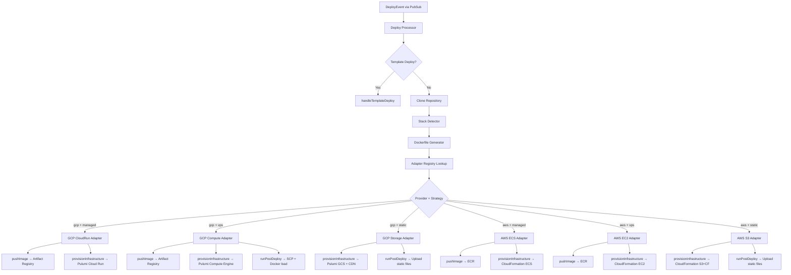

# Design Document: Unified Deploy Adapters

## Overview

This design refactors the deploy pipeline from two divergent code paths (GCP via Pulumi in `deploy/`, AWS via CodeBuild+CloudFormation in `image-builder/`) into a single orchestration flow with a provider adapter pattern. The key insight is that every deployment follows the same logical steps — clone, detect, generate Dockerfile, build image, push image, provision infrastructure, inject env vars, run post-deploy — but the *mechanism* for each step varies by provider and deploy strategy.

The refactor consolidates duplicated modules (stack detection, Dockerfile generation) into single canonical implementations, introduces a `DeployAdapter` interface that all six deploy targets implement, and replaces the `if (provider === "aws") ... else ...` branching in the processor with a registry-based dispatch.

### Design Decisions

1. **Image-builder's PHP generator is canonical.** The `image-builder/detection/php.ts` generator uses `php-fpm + nginx + supervisor` (production-ready), while `deploy/repo-analyzer/dockerfiles/php.ts` uses `php artisan serve` on `php:cli` (development-grade). The unified generator adopts the image-builder pattern.

2. **Adapters wrap existing infrastructure code.** The Pulumi templates (`deploy/pulumi-templates/gcp.ts`) and CloudFormation templates (`image-builder/deploy-templates/*.yml`) are preserved as-is. Adapters call into them rather than replacing them.

3. **Local Docker build for all providers.** The deploy processor builds Docker images locally (using the generated Dockerfile) for both AWS and GCP. The image-builder's CodeBuild pipeline is retained only for the standalone image-builder API and for backward compatibility with `buildMethod: "codebuild"`.

4. **Unified module lives in `deploy/repo-analyzer/`.** The image-builder service imports from `deploy/repo-analyzer/` rather than maintaining its own detection/generation code. This is the simpler direction since the deploy service is the primary consumer.

## Architecture



### File Structure

```
deploy/
├── processor/
│   ├── index.ts                    # Unified orchestrator (refactored)
│   ├── adapters/
│   │   ├── types.ts                # DeployAdapter interface + AdapterContext
│   │   ├── index.ts                # Adapter registry
│   │   ├── gcp-cloudrun.ts         # GCP Cloud Run adapter
│   │   ├── gcp-compute.ts          # GCP Compute Engine adapter
│   │   ├── gcp-storage.ts          # GCP Cloud Storage + CDN adapter
│   │   ├── aws-ecs.ts              # AWS ECS Fargate adapter
│   │   ├── aws-ec2.ts              # AWS EC2 adapter
│   │   └── aws-s3.ts               # AWS S3 + CloudFront adapter
│   ├── helpers.ts                  # (unchanged)
│   ├── gcp-helpers.ts              # (unchanged, used by GCP adapters)
│   ├── pulumi-workspace.ts         # (unchanged, used by GCP adapters)
│   ├── run-cmd.ts                  # (unchanged)
│   ├── pulumi-deploy.ts            # DEPRECATED — logic moved to adapters
│   └── aws-deploy.ts               # DEPRECATED — logic moved to adapters
├── repo-analyzer/
│   ├── index.ts                    # Unified public API (detection + generation)
│   ├── types.ts                    # Unified DetectedStack + RepoConfig types
│   ├── detect-subdir.ts            # (unchanged)
│   ├── docker-fixer.ts             # (unchanged)
│   ├── analyzers/                  # Runtime-specific analyzers
│   │   ├── node.ts
│   │   ├── php.ts                  # Enhanced with image-builder's extension logic
│   │   ├── python.ts
│   │   └── go.ts
│   ├── dockerfiles/                # Unified Dockerfile generators
│   │   ├── node.ts                 # Merged from both services
│   │   ├── php.ts                  # Uses image-builder's php-fpm pattern
│   │   ├── python.ts
│   │   └── go.ts
│   └── utils.ts                    # (unchanged)
├── pulumi-templates/               # (unchanged — adapters call into these)
│   ├── gcp.ts
│   ├── aws.ts
│   ├── types.ts
│   └── ...
└── shared.ts                       # (unchanged)

image-builder/
├── detection/
│   ├── index.ts                    # Re-exports from deploy/repo-analyzer
│   └── types.ts                    # Re-exports DetectedStack from deploy/repo-analyzer
├── ...                             # Rest unchanged
```

## Components and Interfaces

### DeployAdapter Interface

```typescript
// deploy/processor/adapters/types.ts

import type { DeployEvent } from "../../shared";
import type { RunCmdFn } from "../run-cmd";

/** Detected stack information passed to adapters */
export interface DetectedStackInfo {
  runtime: string;
  framework: string;
  packageManager: string;
  port: number;
  subDir: string;
  isStatic: boolean;
}

/** Context shared across all adapter method calls for a single deployment */
export interface AdapterContext {
  deploymentId: string;
  repoName: string;
  shortId: string;
  region: string;
  repoDir: string;
  workDir: string;
  commitHash: string;
  providerCredentials: { apiKey: string; apiSecret: string };
  event: DeployEvent;
  detectedStack: DetectedStackInfo;
  runCmd: RunCmdFn;
  appendLog: (line: string) => Promise<void>;
  writeFile: (path: string, data: string, enc: string) => Promise<void>;
  readFile: (path: string, enc: string) => Promise<string>;
  rm: (path: string, opts: { recursive: boolean; force: boolean }) => Promise<void>;
}

/** Result from pushImage */
export interface PushImageResult {
  /** Remote image URI after push (e.g., ECR URI or AR URI) */
  remoteImageUri: string;
  /** Whether the build was skipped (cached or static) */
  skipped: boolean;
}

/** Result from provisionInfrastructure */
export interface ProvisionResult {
  /** Application URL extracted from infrastructure outputs */
  appUrl: string;
  /** Server IP (for VPS deploys that need post-deploy steps) */
  serverIp?: string;
  /** Additional outputs from the infrastructure provider */
  outputs: Record<string, string>;
}

/** Result from the full adapter execution */
export interface AdapterResult {
  appUrl: string;
  dockerImage: string;
}

/** The interface all provider adapters implement */
export interface DeployAdapter {
  /** Unique identifier for this adapter (e.g., "gcp-cloudrun") */
  readonly id: string;

  /** Whether this adapter handles the given provider + strategy */
  supports(provider: string, deployStrategy: string): boolean;

  /** Build and push the Docker image to the provider's registry.
   *  Static adapters return { skipped: true }. */
  pushImage(ctx: AdapterContext, localImage: string): Promise<PushImageResult>;

  /** Provision cloud infrastructure (Pulumi or CloudFormation) */
  provisionInfrastructure(ctx: AdapterContext, imageUri: string): Promise<ProvisionResult>;

  /** Inject environment variables into the running application.
   *  Called before provisionInfrastructure for providers that bake env vars
   *  into the infrastructure definition (Pulumi config, CFN parameters). */
  injectEnvVars(ctx: AdapterContext, envVars: Array<{ name: string; value: string }>): Promise<void>;

  /** Run post-deploy steps (SCP image transfer, static file upload, migrations).
   *  Called after provisionInfrastructure completes. */
  runPostDeploy(ctx: AdapterContext, provision: ProvisionResult): Promise<void>;
}
```

### Adapter Registry

```typescript
// deploy/processor/adapters/index.ts

import type { DeployAdapter } from "./types";
import { GcpCloudRunAdapter } from "./gcp-cloudrun";
import { GcpComputeAdapter } from "./gcp-compute";
import { GcpStorageAdapter } from "./gcp-storage";
import { AwsEcsAdapter } from "./aws-ecs";
import { AwsEc2Adapter } from "./aws-ec2";
import { AwsS3Adapter } from "./aws-s3";

const adapters: DeployAdapter[] = [
  new GcpCloudRunAdapter(),
  new GcpComputeAdapter(),
  new GcpStorageAdapter(),
  new AwsEcsAdapter(),
  new AwsEc2Adapter(),
  new AwsS3Adapter(),
];

/** Strategy normalization: maps user-facing strategy names to internal names */
const STRATEGY_MAP: Record<string, string> = {
  managed: "managed",
  vps: "vps",
  static: "static",
};

/**
 * Look up the adapter for a given provider + deploy strategy.
 * Throws a descriptive error if no adapter is registered.
 */
export function getAdapter(provider: string, deployStrategy: string): DeployAdapter {
  const strategy = STRATEGY_MAP[deployStrategy] || deployStrategy;
  const adapter = adapters.find(a => a.supports(provider, strategy));
  if (!adapter) {
    throw new Error(
      `No deploy adapter registered for provider="${provider}" strategy="${strategy}". ` +
      `Supported combinations: ${adapters.map(a => a.id).join(", ")}`
    );
  }
  return adapter;
}

/** Register a new adapter (for extensibility) */
export function registerAdapter(adapter: DeployAdapter): void {
  adapters.push(adapter);
}

/** List all registered adapter IDs (for diagnostics) */
export function listAdapterIds(): string[] {
  return adapters.map(a => a.id);
}
```

### Unified DetectedStack Type

The two existing types are merged into one that carries all information needed by both Dockerfile generators and adapters:

```typescript
// deploy/repo-analyzer/types.ts (extended)

export type DetectedStack =
  | {
      runtime: "node";
      framework: "nextjs" | "nuxt" | "sveltekit" | "spa" | "angular" | "astro" | "generic";
      packageManager: "npm" | "pnpm" | "yarn" | "bun";
      packageManagerVersion: string;
      nodeVersion: string;
      hasStandalone: boolean;
      isStatic: boolean;
      subDir: string;
      port: number;
      nativeDeps: NativeDep[];
      startCommand: string;
    }
  | {
      runtime: "php";
      framework: "laravel" | "generic";
      phpVersion: string;
      phpExtensions: string[];
      hasNodeAssets: boolean;
      subDir: string;
      port: number;
    }
  | {
      runtime: "python";
      framework: "django" | "fastapi" | "flask" | "generic";
      pythonVersion: string;
      subDir: string;
      port: number;
    }
  | {
      runtime: "go";
      goVersion: string;
      subDir: string;
      port: number;
    }
  | {
      runtime: "unknown";
      subDir: string;
      port: number;
    };
```

This replaces both `image-builder/detection/types.ts` (which lacked version/port info) and the `RepoConfig` interface (which used a flat structure with many optional fields). The `image-builder/detection/types.ts` file becomes a re-export:

```typescript
// image-builder/detection/types.ts
export type { DetectedStack } from "../../deploy/repo-analyzer/types";
```

### Unified Processor Flow

```typescript
// deploy/processor/index.ts (refactored core logic)

// Template deploys bypass the unified pipeline
if (event.templateId) {
  // ... existing handleTemplateDeploy logic (unchanged)
  return;
}

// 1. Clone repository
const repoDir = await cloneRepo(event, workDir);

// 2. Detect stack
const detectedStack = detectStack(repoDir);

// 3. Generate Dockerfile (unless static or user-provided)
const isStatic = event.deployStrategy === "static";
if (!isStatic && !existsSync(join(repoDir, "Dockerfile"))) {
  const dockerfile = generateDockerfile(detectedStack, repoDir);
  await writeFile(join(repoDir, "Dockerfile"), dockerfile, "utf-8");
}

// 4. Build Docker image locally (unless static)
let localImage = "";
if (!isStatic) {
  localImage = await buildDockerImage(repoDir, repoName, shortId, ctx);
}

// 5. Look up adapter
const adapter = getAdapter(provider, event.deployStrategy || "managed");

// 6. Inject env vars
await adapter.injectEnvVars(adapterCtx, event.envVars || []);

// 7. Push image
const pushResult = await adapter.pushImage(adapterCtx, localImage);

// 8. Provision infrastructure
const provision = await adapter.provisionInfrastructure(adapterCtx, pushResult.remoteImageUri);

// 9. Post-deploy
await adapter.runPostDeploy(adapterCtx, provision);

// 10. Update deployment record
await db.exec`UPDATE deployments SET status = 'success', app_url = ${provision.appUrl} ...`;
```

### Adapter Implementations (Summary)

Each adapter encapsulates the provider-specific logic currently spread across `pulumi-deploy.ts`, `aws-deploy.ts`, and `gcp-helpers.ts`.

#### GCP Cloud Run Adapter (`gcp-cloudrun.ts`)

- `supports("gcp", "managed")` → true
- `pushImage`: Gets GCP access token from service account key, enables `artifactregistry.googleapis.com` and `run.googleapis.com` APIs, creates AR repo if needed, tags and pushes Docker image to Artifact Registry.
- `injectEnvVars`: Sets `imageUri` in Pulumi config. Env vars are baked into the Pulumi program's Cloud Run container `envs` array.
- `provisionInfrastructure`: Sets up Pulumi workspace, restores previous state, runs `pulumi up` with the existing `buildGcpCloudRun` template. Handles Cloud Run service import for first deploys.
- `runPostDeploy`: Saves Pulumi state to DB. No additional post-deploy steps needed.

#### GCP Compute Engine Adapter (`gcp-compute.ts`)

- `supports("gcp", "vps")` → true
- `pushImage`: Same AR push flow as Cloud Run adapter. Also enables `compute.googleapis.com` API.
- `injectEnvVars`: Replaces `__AR_IMAGE_URI__`, `__AR_TOKEN__`, `__USER_ENV_FLAGS__`, `__DEPLOY_DB_*__` placeholders in the Pulumi program.
- `provisionInfrastructure`: Sets up Pulumi workspace with SSH keys, runs `pulumi up` with the existing `buildGcpComputeEngine` template.
- `runPostDeploy`: Waits for server SSH, transfers Docker image via SCP, loads and starts container with correct port mapping and env vars. Configures nginx proxy.

#### GCP Cloud Storage + CDN Adapter (`gcp-storage.ts`)

- `supports("gcp", "static")` → true
- `pushImage`: Returns `{ skipped: true }` — no Docker image needed.
- `injectEnvVars`: No-op for static sites.
- `provisionInfrastructure`: Enables `compute.googleapis.com` API, runs `pulumi up` with the existing `buildGcpCloudStorageCdn` template.
- `runPostDeploy`: Builds static site locally using detected package manager, identifies output directory, uploads files to GCS bucket using the GCS JSON API.

#### AWS ECS Fargate Adapter (`aws-ecs.ts`)

- `supports("aws", "managed")` → true
- `pushImage`: Builds Docker image locally, creates ECR repository if needed, pushes to ECR.
- `injectEnvVars`: Injects env vars into the ECS task definition by modifying the CloudFormation template's `Environment` section (same approach as the current deploy Lambda).
- `provisionInfrastructure`: Deploys CloudFormation stack using `image-builder/deploy-templates/ecs-fargate.yml`. Handles `ROLLBACK_COMPLETE` cleanup. Polls stack status.
- `runPostDeploy`: Extracts app URL from CloudFormation stack outputs.

#### AWS EC2 Adapter (`aws-ec2.ts`)

- `supports("aws", "vps")` → true
- `pushImage`: Same ECR push flow as ECS adapter.
- `injectEnvVars`: Passes env vars as `EnvVarsJson` CloudFormation parameter.
- `provisionInfrastructure`: Deploys CloudFormation stack using `image-builder/deploy-templates/ec2.yml`. Passes `SelfHostedServices` and `TechStack` parameters.
- `runPostDeploy`: Extracts app URL from CloudFormation stack outputs.

#### AWS S3 + CloudFront Adapter (`aws-s3.ts`)

- `supports("aws", "static")` → true
- `pushImage`: Returns `{ skipped: true }`.
- `injectEnvVars`: No-op.
- `provisionInfrastructure`: Builds static site locally, creates S3 bucket, syncs files, deploys CloudFormation stack using `image-builder/deploy-templates/s3.yml`.
- `runPostDeploy`: Extracts app URL (CloudFront domain) from stack outputs.

### Build Method Handling

The `buildMethod` field on `DeployEvent` controls how Docker images are built:

- `"dockerfile"` (default): Local `docker build` using the generated Dockerfile. This is the standard path for all adapters.
- `"codebuild"`: Routes to the existing AWS CodeBuild pipeline (current `aws-deploy.ts` logic). This is preserved for backward compatibility during migration. The processor checks `event.buildMethod === "codebuild"` before adapter dispatch and falls back to the legacy `handleAwsDeploy` path.

```typescript
// In the processor, before adapter dispatch:
if (event.buildMethod === "codebuild") {
  await handleAwsDeploy(event, ctx); // Legacy path
  return;
}
```

## Data Models

### Database Schema (Unchanged)

The `deployments` table schema is preserved exactly:

| Column | Type | Description |
|--------|------|-------------|
| id | UUID | Primary key |
| provider_id | UUID | FK to server_providers |
| git_connection_id | UUID | FK to git connections |
| project_id | UUID | FK to projects |
| repo | TEXT | Repository slug (e.g., "user/repo") |
| branch | TEXT | Git branch |
| status | TEXT | pending → building → deploying → success/failed |
| logs | TEXT | Append-only deployment log |
| app_url | TEXT | Final application URL |
| commit_hash | TEXT | Git commit SHA |
| docker_image | TEXT | Docker image name/URI |
| deploy_strategy | TEXT | managed/vps/static |
| tofu_script | TEXT | Pulumi program + embedded state |
| created_at | TIMESTAMP | |
| updated_at | TIMESTAMP | |

### DeployEvent Interface (Unchanged)

```typescript
export interface DeployEvent {
  deploymentId: string;
  appId: string;
  providerId: string;
  gitConnectionId: string;
  projectId: string;
  repo: string;
  branch: string;
  tofuScript: string;
  techStack: string[];
  primaryLanguage: string;
  registryUrl: string;
  deployStrategy: string;
  buildMethod: "dockerfile" | "railpack" | "nixpacks" | "codebuild";
  templateId?: string;
  envVars?: Array<{ name: string; value: string }>;
}
```

### Adapter Registry Mapping

| Provider | Strategy | Adapter | Infrastructure |
|----------|----------|---------|----------------|
| gcp | managed | `gcp-cloudrun` | Pulumi → Cloud Run |
| gcp | vps | `gcp-compute` | Pulumi → Compute Engine |
| gcp | static | `gcp-storage` | Pulumi → GCS + CDN |
| aws | managed | `aws-ecs` | CloudFormation → ECS Fargate |
| aws | vps | `aws-ec2` | CloudFormation → EC2 |
| aws | static | `aws-s3` | CloudFormation → S3 + CloudFront |

## Correctness Properties

*A property is a characteristic or behavior that should hold true across all valid executions of a system — essentially, a formal statement about what the system should do. Properties serve as the bridge between human-readable specifications and machine-verifiable correctness guarantees.*

### Property 1: Stack detection identifies correct runtime

*For any* project directory containing exactly one of the runtime marker files (package.json for Node.js, composer.json for PHP, requirements.txt/pyproject.toml/Pipfile/manage.py for Python, go.mod for Go), the Stack_Detector SHALL return the correct runtime, and for that runtime SHALL correctly identify the framework, package manager, and version information based on the file contents.

**Validates: Requirements 1.1, 1.2, 1.3, 1.4, 1.5**

### Property 2: Subdirectory detection scopes correctly

*For any* repository directory structure where the application code resides in a subdirectory (identified by the presence of runtime marker files in a nested directory but not the root), the Stack_Detector SHALL identify that subdirectory and scope all subsequent detection to it.

**Validates: Requirements 1.6**

### Property 3: PHP Laravel Dockerfile uses production-ready pattern

*For any* detected PHP Laravel stack with any valid PHP version (7.x through 8.4), the generated Dockerfile SHALL use a `php:X.Y-fpm-{debian}` base image, include `nginx` and `supervisor` packages, contain multi-stage build stages (base, deps, frontend when Node assets present, runner), and include Laravel setup commands (storage permissions, .env generation, artisan key:generate, cache clearing).

**Validates: Requirements 2.2, 2.3, 2.4**

### Property 4: PHP extension installation matches composer requirements

*For any* PHP project with `ext-*` requirements in composer.json or composer.lock, the generated Dockerfile SHALL include installation commands for all required extensions that are not built-in, using `docker-php-ext-install` for standard extensions and `pecl install` for PECL extensions, with version-specific handling (e.g., `imap` via PECL on PHP 8.4+).

**Validates: Requirements 2.5**

### Property 5: Node.js Dockerfile uses correct version and package manager

*For any* detected Node.js stack, the generated Dockerfile SHALL use the Node.js version detected from `.nvmrc`, `.node-version`, or `package.json` engines field, use the correct package manager install command (npm ci, pnpm install, yarn install, bun install), and produce the correct framework-specific output structure (Next.js standalone, Nuxt SSR/static, SvelteKit, SPA, etc.).

**Validates: Requirements 2.6, 2.7**

### Property 6: Python Dockerfile uses correct production server

*For any* detected Python stack, the generated Dockerfile SHALL use `gunicorn` as the production server for Django and Flask frameworks, and `uvicorn` for FastAPI.

**Validates: Requirements 2.8**

### Property 7: User-provided Dockerfile is preserved

*For any* repository that already contains a Dockerfile at the root (or in the detected subdirectory), the deploy pipeline SHALL not overwrite it and SHALL use the existing Dockerfile for the Docker build.

**Validates: Requirements 2.11**

### Property 8: Adapter registry covers all deploy targets and rejects invalid combinations

*For any* valid (provider, deployStrategy) combination from the set {(gcp, managed), (gcp, vps), (gcp, static), (aws, managed), (aws, vps), (aws, static)}, the adapter registry SHALL return an adapter whose `supports()` method returns true for that combination. *For any* (provider, deployStrategy) combination NOT in that set, the registry SHALL throw an error containing both the provider and strategy in the message.

**Validates: Requirements 4.1, 4.3, 13.1**

### Property 9: Environment variables are injected through provider-appropriate mechanism

*For any* non-empty set of user-provided environment variables and any adapter, the adapter's `injectEnvVars` method SHALL ensure all provided variables are forwarded to the running application through the provider-appropriate mechanism (Pulumi config for GCP, CloudFormation parameters for AWS, docker run flags for VPS).

**Validates: Requirements 15.1**

### Property 10: Infrastructure env vars override user-provided values

*For any* deployment where both user-provided environment variables and infrastructure services (database, cache) are present, and the user-provided variables include keys that conflict with infrastructure connection variables (e.g., `DB_HOST`, `REDIS_HOST`), the infrastructure-derived values SHALL take precedence in the final application environment.

**Validates: Requirements 15.2, 15.3**

## Error Handling

### Adapter-Level Errors

Each adapter method can throw errors that the processor catches and handles uniformly:

| Error Scenario | Handling |
|---|---|
| GCP access token exchange fails | Throw with "Failed to get GCP access token from service account key" — logged and deployment marked failed |
| ECR repository creation fails | Retry once, then throw — AWS permissions issue |
| Docker build fails | Invoke `patchDockerfile`, retry up to 3 times, then fail |
| Pulumi up fails with 404/409 | Wipe state and retry fresh (existing logic preserved) |
| CloudFormation stack in ROLLBACK_COMPLETE | Delete stack and recreate (existing logic preserved) |
| SCP transfer fails | Log warning, deployment continues (server will pull from registry on next boot) |
| Static file upload fails | Log warning with error message, deployment marked failed |
| Adapter not found in registry | Throw descriptive error with provider + strategy + list of supported adapters |

### Processor-Level Error Handling

The processor wraps the entire adapter flow in a try/catch:

```typescript
try {
  // ... clone, detect, generate, adapter dispatch ...
} catch (e: any) {
  await appendLog(deploymentId, `[${ts()}] ✗ Deployment failed: ${e.message || e}`);
  await db.exec`UPDATE deployments SET status = 'failed', updated_at = NOW() WHERE id = ${deploymentId}`;
}
```

### Docker Build Retry Logic

```
Attempt 1: docker build .
  → If fails: patchDockerfile(error, currentDockerfile)
    → If patch found: apply patch, continue to attempt 2
    → If no patch: throw immediately
Attempt 2: docker build --no-cache .
  → If fails: patchDockerfile(error, currentDockerfile)
    → If patch found: apply patch, continue to attempt 3
    → If no patch: throw immediately
Attempt 3: docker build --no-cache .
  → If fails: throw with last 20 lines of build output
```

## Testing Strategy

### Property-Based Tests (Vitest + fast-check)

Property-based tests validate the correctness properties defined above. Each test generates random inputs and verifies universal properties hold across all of them.

**Library:** `fast-check` (the standard PBT library for TypeScript/Vitest)
**Minimum iterations:** 100 per property test
**Tag format:** `Feature: unified-deploy-adapters, Property {N}: {description}`

Tests to implement:

1. **Stack detection** — Generate random directory structures with marker files, verify correct runtime/framework/PM detection.
2. **Subdirectory detection** — Generate random nested directory structures, verify correct subdirectory identification.
3. **PHP Dockerfile generation** — Generate random PHP versions and Laravel configs, verify Dockerfile contains fpm base image, nginx, supervisor, multi-stage build, and Laravel setup commands.
4. **PHP extension installation** — Generate random composer.json with ext-* requirements across PHP versions, verify correct install commands.
5. **Node.js Dockerfile generation** — Generate random Node.js configs (version, PM, framework), verify correct Dockerfile output.
6. **Python Dockerfile generation** — Generate random Python framework configs, verify correct production server.
7. **User Dockerfile preservation** — Generate random repos with/without existing Dockerfiles, verify preservation.
8. **Adapter registry** — Enumerate all valid and invalid (provider, strategy) pairs, verify correct adapter or error.
9. **Env var injection** — Generate random env var sets, verify they appear in provider-specific output.
10. **Infrastructure env var precedence** — Generate conflicting user + infra env vars, verify infra wins.

### Unit Tests (Vitest)

Example-based tests for specific scenarios and edge cases:

- Template deploy bypasses unified pipeline
- `buildMethod: "codebuild"` routes to legacy AWS path
- Docker build retry with auto-patching (mock Docker failures)
- Deployment status progression: pending → building → deploying → success
- Error logging includes last 20 lines of failed step output
- Image caching: same repo/branch/commit reuses cached image
- Go Dockerfile uses multi-stage Alpine build

### Integration Tests

Integration tests with mocked external services (AWS SDK, GCP APIs, Docker CLI):

- Full pipeline: clone → detect → generate → build → push → provision → post-deploy
- GCP Cloud Run: AR push + Pulumi Cloud Run provisioning
- AWS ECS: ECR push + CloudFormation ECS provisioning
- Static deploys: skip Docker, build locally, upload files
- Pulumi state save/restore across deployments
- CloudFormation stack lifecycle (create, update, rollback recovery)
